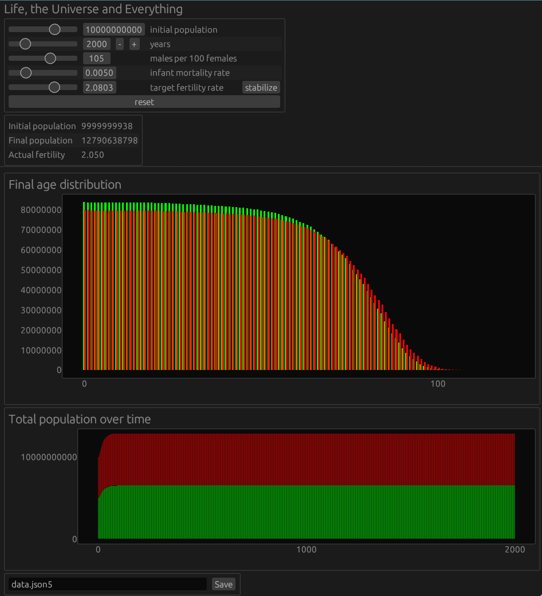

# Life, the Universe and Everything

Simple demographics simulator.



To build you need Rust/Cargo: https://rustup.rs/.

```shell
cargo run --release
```

GUI is built with egui/[eframe](https://github.com/emilk/egui/tree/main/crates/eframe).
Check out that link if you need help with GUI-specific system dependencies.
This is probably only needed if you use Linux.
